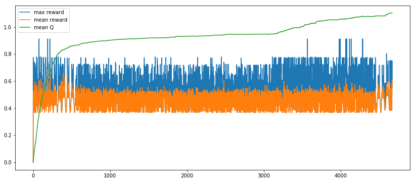

# robot_mimic
A simple python environment to do machine learning on. I created it from scratch to train myself and get the full experience.

## Installation
On my tensorflow docker I need to install PIL.
I do this in jupyter with the magic command line token "!".

!python3 -m pip install --upgrade Pillow

## What's this?
Simulates two 2D robot arms.
One arm (colored) is supposed to match as much as possible with the second arm (blue shape).

The rate of the matching (reward) is calculated by the averaged sum of overlapping pixels.

 

## Example Training session

