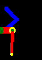
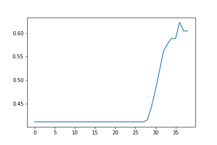

# robot_mimic
A simple python environment to do machine learning on. I created it from scratch to train myself and get the full experience.

## What's this?
Simulates two 2D robot arms. One arm is supposed to match as much as possible with the second arm.

The rate of the matching (reward) is calculated by the averaged sum of overlapping pixels.

  
